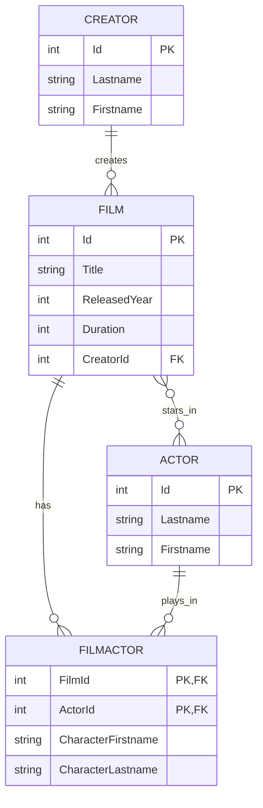

# 🎬 DemoEFCodeFirst - Entity Framework Core Code First


## 📚 À propos du projet

Projet de démonstration pédagogique pour l'apprentissage d'Entity Framework Core avec l'approche **Code First**. Ce projet couvre les concepts essentiels de la gestion de base de données avec EF Core, du CRUD basique aux optimisations de performance avancées.

### 🎯 Objectifs pédagogiques

- ✅ Maîtriser l'approche Code First d'Entity Framework Core
- ✅ Comprendre les relations entre entités (One-to-Many, Many-to-Many)
- ✅ Apprendre les opérations CRUD asynchrones
- ✅ Optimiser les requêtes et gérer le tracking
- ✅ Manipuler les migrations et le schéma de base de données
- ✅ Utiliser la Fluent API pour la configuration avancée
- ✅ Implémenter le pattern Repository et Service

---

## 🏗️ Architecture du projet

```
DemoEFCodeFirst/
├── 📁 Configurations/          # Configuration Fluent API des entités
│   ├── ActorConfiguration.cs
│   ├── CreatorConfiguration.cs
│   └── FilmConfiguration.cs
├── 📁 Data/                    # DbContext et accès aux données
│   └── DataContext.cs
├── 📁 Models/                  # Entités du domaine
│   ├── Actor.cs
│   ├── Creator.cs
│   ├── Film.cs
│   └── FilmActor.cs          # Table de jonction Many-to-Many
├── 📁 Repositories/            # Pattern Repository
│   ├── Interfaces/
│   │   ├── IRepository.cs
│   │   └── IFilmRepository.cs
│   └── Implementations/
│       ├── Repository.cs
│       └── FilmRepository.cs
├── 📁 Services/                # Logique métier
│   ├── Interfaces/
│   │   └── IFilmService.cs
│   └── FilmService.cs
├── 📁 Migrations/              # Historique des migrations
├── Menu.cs                     # Interface de démonstration
└── Program.cs                  # Point d'entrée
```

---

## 🚀 Prérequis

- [.NET 10.0 SDK](https://dotnet.microsoft.com/download/dotnet/10.0) ou supérieur
- [SQL Server LocalDB](https://learn.microsoft.com/sql/database-engine/configure-windows/sql-server-express-localdb) ou SQL Server
- Un IDE : [Visual Studio 2022](https://visualstudio.microsoft.com/), [Visual Studio Code](https://code.visualstudio.com/) ou [JetBrains Rider](https://www.jetbrains.com/rider/)
- [Entity Framework Core CLI Tools](https://learn.microsoft.com/ef/core/cli/dotnet)

### Installation des outils EF Core

```bash
# Installation globale
dotnet tool install --global dotnet-ef

# Mise à jour (si déjà installé)
dotnet tool update --global dotnet-ef

# Vérification de l'installation
dotnet ef --version
```

---

## 📦 Installation et configuration

### 1. Cloner le dépôt

```bash
git clone https://github.com/votre-username/DemoEFCodeFirst.git
cd DemoEFCodeFirst
```

### 2. Restaurer les packages NuGet

```bash
dotnet restore
```

### 3. Configurer la chaîne de connexion

La chaîne de connexion est définie dans `DataContext.cs` (méthode `OnConfiguring`) :

```csharp
string connectionString = @"Data Source=(localdb)\MSSQLLocalDB;
                            Initial Catalog=MovieDB;
                            Integrated Security=True;
                            Trust Server Certificate=True";
```

> 💡 **Astuce** : Pour utiliser une autre base de données, modifiez cette chaîne de connexion.

### 4. Créer la base de données

```bash
# Appliquer les migrations existantes
dotnet ef database update

# OU créer une nouvelle migration (si besoin)
dotnet ef migrations add InitialCreate
dotnet ef database update
```

### 5. Lancer l'application

```bash
dotnet run
```

---

## 🎓 Concepts couverts

### 1️⃣ CRUD de base

#### **CREATE** - Ajouter des données
```csharp
var actor = new Actor
{
    Lastname = "Dujardin",
    Firstname = "Jean"
};
context.Actors.Add(actor);
await context.SaveChangesAsync();
```

#### **READ** - Lire des données
```csharp
// Récupérer tous les acteurs
var actors = await context.Actors.ToListAsync();

// Recherche par ID
var actor = await context.Actors.FindAsync(1);

// Filtrage avec Where()
var films2009 = await context.Films
    .Where(f => f.ReleasedYear == 2009)
    .ToListAsync();
```

#### **UPDATE** - Modifier des données
```csharp
var film = await context.Films.FirstOrDefaultAsync();
film.ReleasedYear = 2010;
await context.SaveChangesAsync();
```

#### **DELETE** - Supprimer des données
```csharp
var actor = await context.Actors.FindAsync(1);
context.Actors.Remove(actor);
await context.SaveChangesAsync();
```

---

### 2️⃣ Relations entre entités

#### **One-to-Many** : Creator ➡️ Films
```csharp
// Un créateur peut avoir plusieurs films
public class Creator
{
    public int Id { get; set; }
    public string Lastname { get; set; }
    public string Firstname { get; set; }
    
    public ICollection<Film> Films { get; set; } = [];
}

// Configuration Fluent API
builder.HasOne(f => f.Creator)
    .WithMany(c => c.Films)
    .HasForeignKey(f => f.CreatorId);
```

#### **Many-to-Many** : Films ⬌ Actors (avec table de jonction)
```csharp
// Table de jonction explicite avec métadonnées
public class FilmActor
{
    public int FilmId { get; set; }
    public int ActorId { get; set; }
    public string? CharacterLastname { get; set; }
    public string CharacterFirstname { get; set; }
    
    public Film Film { get; set; }
    public Actor Actor { get; set; }
}

// Configuration avec UsingEntity()
builder.HasMany(f => f.Actors)
    .WithMany(a => a.Films)
    .UsingEntity<FilmActor>(builder =>
    {
        builder.HasKey(fa => new { fa.ActorId, fa.FilmId });
        // ... configuration supplémentaire
    });
```

---

### 3️⃣ Chargement des relations

#### **Eager Loading** (recommandé)
```csharp
// Charge les données en UNE requête SQL
var films = await context.Films
    .Include(f => f.Creator)
    .Include(f => f.Actors)
    .ToListAsync();
```

#### **Explicit Loading**
```csharp
var film = await context.Films.FirstAsync();
await context.Entry(film)
    .Reference(f => f.Creator)
    .LoadAsync();
```

---

### 4️⃣ Requêtes avancées

#### **Filtrage avec Where()**
```csharp
// Filtrage simple
var filmsLongs = await context.Films
    .Where(f => f.Duration >= 180)
    .ToListAsync();

// Filtrage multiple (AND)
var filmsRecents = await context.Films
    .Where(f => f.ReleasedYear > 2010 && f.Duration > 180)
    .ToListAsync();

// Recherche LIKE avec Contains()
var filmsAvatar = await context.Films
    .Where(f => f.Title.Contains("Avatar"))
    .ToListAsync();
```

#### **Tri avec OrderBy()**
```csharp
// Tri croissant
var films = await context.Films
    .OrderBy(f => f.Title)
    .ToListAsync();

// Tri décroissant
var films = await context.Films
    .OrderByDescending(f => f.ReleasedYear)
    .ToListAsync();

// Tri multiple
var films = await context.Films
    .OrderByDescending(f => f.ReleasedYear)
    .ThenBy(f => f.Title)
    .ToListAsync();
```

#### **Pagination**
```csharp
int pageSize = 10;
int pageNumber = 1;

var films = await context.Films
    .OrderBy(f => f.Title)
    .Skip((pageNumber - 1) * pageSize)
    .Take(pageSize)
    .ToListAsync();
```

#### **Agrégations**
```csharp
// Compter
var count = await context.Films.CountAsync();

// Moyenne
var avgDuration = await context.Films.AverageAsync(f => f.Duration);

// Min/Max
var maxDuration = await context.Films.MaxAsync(f => f.Duration);
var minDuration = await context.Films.MinAsync(f => f.Duration);

// Vérifier l'existence
var hasLongFilms = await context.Films.AnyAsync(f => f.Duration > 180);
```

#### **Projections avec Select()**
```csharp
// Projection simple
var titres = await context.Films
    .Select(f => f.Title)
    .ToListAsync();

// Projection avec type anonyme
var filmsSummary = await context.Films
    .Select(f => new
    {
        f.Title,
        DurationHours = f.Duration / 60.0,
        Year = f.ReleasedYear
    })
    .ToListAsync();
```

---

### 5️⃣ Tracking et Performance

#### **AsNoTracking()** - Lecture seule optimisée
```csharp
// AVEC tracking (par défaut) - pour modification
var filmsTracked = await context.Films.ToListAsync();

// SANS tracking - meilleure performance pour lecture seule
var filmsNoTracked = await context.Films
    .AsNoTracking()
    .ToListAsync();
```

**Avantages de AsNoTracking() :**
- ✓ Consomme moins de mémoire
- ✓ Plus rapide pour les requêtes de lecture
- ✓ Parfait pour les API GET, exports, rapports

**Inconvénients :**
- ✗ Impossible de modifier directement les entités
- ✗ Pas de détection automatique des changements

#### **ChangeTracker** - États des entités
```csharp
var film = await context.Films.FirstAsync();
var entry = context.Entry(film);

// États possibles :
// - Detached  : Non suivie
// - Unchanged : Suivie, pas de changement
// - Added     : Nouvelle entité à insérer
// - Modified  : Entité modifiée
// - Deleted   : Marquée pour suppression

// Annuler les changements
entry.Reload();

// Nettoyer le tracker
context.ChangeTracker.Clear();
```

#### **ToQueryString()** - Debug SQL
```csharp
var query = context.Films
    .Where(f => f.Duration > 120)
    .OrderBy(f => f.Title)
    .Include(f => f.Creator);

var sql = query.ToQueryString();
Console.WriteLine(sql);
```

#### **Batch SaveChanges**
```csharp
// ❌ MAUVAISE PRATIQUE - SaveChanges dans la boucle
for (int i = 0; i < 10; i++)
{
    context.Actors.Add(new Actor { Lastname = $"Actor {i}" });
    await context.SaveChangesAsync(); // 10 requêtes SQL!
}

// ✅ BONNE PRATIQUE - Un seul SaveChanges
for (int i = 0; i < 10; i++)
{
    context.Actors.Add(new Actor { Lastname = $"Actor {i}" });
}
await context.SaveChangesAsync(); // 1 seule requête batch!
```

---

### 6️⃣ Migrations et Schéma

#### **Commandes de migration**


| Opération | CLI .NET (dotnet ef) | Package Manager Console (PMC) |
|-----------|----------------------|-------------------------------|
| Ajouter une migration | `dotnet ef migrations add NomMigration` | `Add-Migration NomMigration` |
| Appliquer les migrations | `dotnet ef database update` | `Update-Database` |
| Annuler la dernière migration | `dotnet ef migrations remove` | `Remove-Migration` |
| Revenir à une migration spécifique | `dotnet ef database update NomMigration` | `Update-Database NomMigration` |
| Générer un script SQL | `dotnet ef migrations script` | `Script-Migration` |
| Lister les migrations | `dotnet ef migrations list` | `Get-Migration` |


#### **Fluent API vs Data Annotations**

**Data Annotations** (dans le modèle) :
```csharp
public class Film
{
    [Key]
    public int Id { get; set; }
    
    [Required]
    [MaxLength(200)]
    public string Title { get; set; }
}
```

**Fluent API** (dans Configuration) :
```csharp
public class FilmConfiguration : IEntityTypeConfiguration<Film>
{
    public void Configure(EntityTypeBuilder<Film> builder)
    {
        builder.HasKey(e => e.Id);
        
        builder.Property(e => e.Title)
            .IsRequired()
            .HasMaxLength(200);
    }
}
```

**Comparaison :**

| Critère | Data Annotations | Fluent API |
|---------|------------------|------------|
| Simplicité | ✅ Plus simple | ❌ Plus verbeux |
| Emplacement | Dans le modèle | Configuration séparée |
| Séparation des préoccupations | ❌ Mélange domaine/persistence | ✅ Séparation claire |
| Fonctionnalités | ❌ Limitées | ✅ Complètes |
| **Recommandation** | Pour débuter | **Pour projets professionnels** |

---

### 7️⃣ Seed Data - Données initiales

```csharp
public class ActorConfiguration : IEntityTypeConfiguration<Actor>
{
    public void Configure(EntityTypeBuilder<Actor> builder)
    {
        // Configuration des propriétés
        builder.Property(a => a.Lastname).HasMaxLength(50);
        builder.Property(a => a.Firstname).HasMaxLength(50);

        // Seed Data - Données de démarrage
        builder.HasData(
            new Actor
            {
                Id = 1,
                Lastname = "Worthington",
                Firstname = "Sam"
            },
            new Actor
            {
                Id = 2,
                Lastname = "Saldaña",
                Firstname = "Zoe"
            }
        );
    }
}
```

---

## 🏛️ Pattern Repository

### Interface générique
```csharp
public interface IRepository<T> where T : class
{
    void Add(T entity);
    IEnumerable<T> GetAll();
    T? GetById(int id);
    void Update(int id, T entity);
    void Delete(int id);
}
```

### Implémentation
```csharp
public abstract class Repository<T> : IRepository<T> where T : class
{
    protected readonly DataContext _context;
    protected readonly DbSet<T> _dbSet;

    public Repository(DataContext context)
    {
        _context = context;
        _dbSet = _context.Set<T>();
    }

    public abstract void Add(T entity);
    public abstract IEnumerable<T> GetAll();
    public abstract T? GetById(int id);
    public abstract void Update(int id, T entity);
    public abstract void Delete(int id);
}
```

### Repository spécifique
```csharp
public class FilmRepository : Repository<Film>, IFilmRepository<Film>
{
    public FilmRepository(DataContext context) : base(context) { }
    
    public IEnumerable<Film> GetByReleasedYear(int year)
    {
        return _dbSet
            .Where(f => f.ReleasedYear == year)
            .Include(f => f.Creator)
            .Include(f => f.Actors);
    }
}
```

---

## 📊 Modèle de données



---

## 🎯 Bonnes pratiques implémentées

### ✅ Configuration
- ✔️ Séparation des configurations (Fluent API dans des classes dédiées)
- ✔️ Utilisation de `ApplyConfigurationsFromAssembly()`
- ✔️ Contraintes de validation (Check Constraints)
- ✔️ Commentaires sur les colonnes

### ✅ Performance
- ✔️ Utilisation de `AsNoTracking()` pour les lectures
- ✔️ Chargement Eager avec `Include()` pour éviter N+1
- ✔️ Batch `SaveChanges()` au lieu de multiples appels
- ✔️ Projections avec `Select()` pour limiter les données

### ✅ Architecture
- ✔️ Pattern Repository pour abstraire l'accès aux données
- ✔️ Services pour la logique métier
- ✔️ Séparation des préoccupations (Domain, Data, Services)
- ✔️ Interfaces pour l'injection de dépendances

### ✅ Asynchronisme
- ✔️ Utilisation systématique de `async`/`await`
- ✔️ Méthodes `*Async()` pour toutes les opérations I/O
- ✔️ Meilleure scalabilité des applications

---

## 🧪 Exemples d'utilisation

### Exemple 1 : Créer un film avec son créateur
```csharp
var creator = new Creator
{
    Lastname = "Nolan",
    Firstname = "Christopher"
};

var film = new Film
{
    Title = "Inception",
    ReleasedYear = 2010,
    Duration = 148,
    Creator = creator  // Liaison automatique
};

context.Films.Add(film);
await context.SaveChangesAsync();
```

### Exemple 2 : Récupérer les films avec relations
```csharp
var films = await context.Films
    .Include(f => f.Creator)
    .Include(f => f.Actors)
    .Where(f => f.ReleasedYear > 2010)
    .OrderByDescending(f => f.Duration)
    .ToListAsync();

foreach (var film in films)
{
    Console.WriteLine($"{film.Title} by {film.Creator.Lastname}");
    Console.WriteLine($"Starring: {string.Join(", ", film.Actors.Select(a => a.Lastname))}");
}
```

### Exemple 3 : Utiliser le service
```csharp
var filmService = new FilmService(context);
var films2022 = filmService.GetAllFilmByReleasedYear(2022);
```

---

## 🔧 Dépannage

### Problème : Migration échoue

```bash
# Supprimer la base de données
dotnet ef database drop

# Supprimer toutes les migrations
rm -rf Migrations/

# Recréer la migration initiale
dotnet ef migrations add InitialCreate
dotnet ef database update
```

### Problème : Erreur de connexion SQL Server

- Vérifiez que SQL Server LocalDB est installé
- Vérifiez la chaîne de connexion dans `DataContext.cs`
- Testez la connexion avec SQL Server Management Studio

### Problème : Package NuGet manquant

```bash
dotnet restore
dotnet clean
dotnet build
```

---

## 📚 Ressources supplémentaires

### Documentation officielle
- [Entity Framework Core Documentation](https://learn.microsoft.com/ef/core/)
- [Code First Approach](https://learn.microsoft.com/ef/core/modeling/)
- [Migrations Overview](https://learn.microsoft.com/ef/core/managing-schemas/migrations/)
- [Query Data](https://learn.microsoft.com/ef/core/querying/)
- [Performance](https://learn.microsoft.com/ef/core/performance/)

---

## 📄 License

Ce projet est sous licence MIT. Voir le fichier `LICENSE` pour plus de détails.

---

## 👤 Auteur

**Quentin** - Formateur .NET / ASP.NET Core

---

<div align="center">

**⭐ Si ce projet vous a été utile, n'hésitez pas à lui donner une étoile ! ⭐**

Made with ❤️ for learning

</div>
